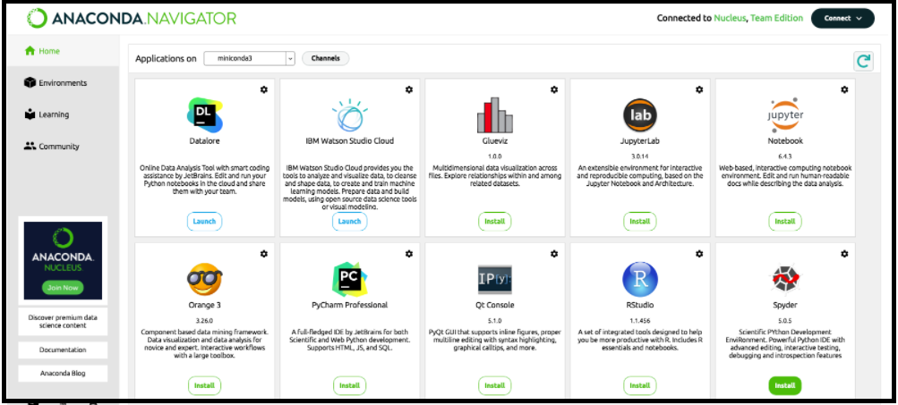
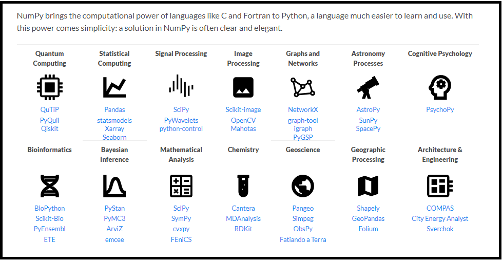
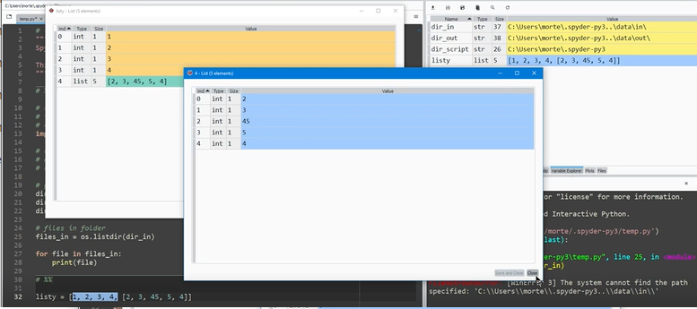
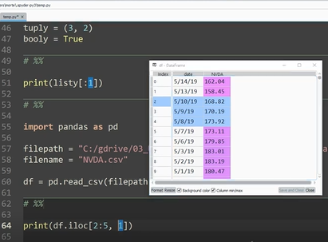

##  

# Python Notes

This is [an example][id] reference-style link. Then, anywhere in the document, you define your link label on a line by itself like this: [id]: http://example.com/  "Optional Title Here"

## Contents 

Tools & Configuration

​	Connecting to a database

​	Testing frameworks

To Do List

Books

​	Testing Books

​	Python Books

Online Resources

Questions

### Tools & Configuration

[PEP 8](https://www.python.org/dev/peps/pep-0008/) 

PEP 8 is a style Guide for writing Python code.

[PyLint](https://pylint.org/)

PyLint enforces PEP8 standards. Tools for UML diagrams, refactoring assistance, & [IDE integration](https://pylint.pycqa.org/en/latest/user_guide/ide-integration.html).

[Typora](https://support.typora.io/media/export/Markdown-Reference.pdf)  

Typora is a simple and configurable document editor that provides excellent [Markdown syntaxt](https://support.typora.io/Markdown-Reference/#code) support for documentation.

[Anaconda Navigator](https://docs.anaconda.com/anaconda/navigator/index.html) is an data science environment that contains Jupyter Notebooks (beta), Jupyter Lab (final release) for documentation, conda environment, R Studio, Sypder IDE (data display is better and cleaner, JSON, dataFrames) and Visual Studio Code IDE.

[iPython](https://ipython.org/)

Support for interactive data visualization inside Jupyter Notebook.

[JupyterLabs & JupyderNotebook](https://jupyter.org/)

JupyterLab is Jupyter’s Next-Generation Notebook Interface. JupyterLab is a web-based interactive development environment for Jupyter notebooks, code, and data. JupyterLab is flexible: configure and arrange the user interface to support a wide range of workflows in data science, scientific computing, and machine learning. JupyterLab is extensible and modular: write plugins that add new components and integrate with existing ones.

[Pandas](https://www.activestate.com/resources/quick-reads/what-is-pandas-in-python-everything-you-need-to-know/)

Pandas is a fast, powerful, flexible open source data analysis and manipulation tool, built on top of the Python programming language. Pandas provides a bunch of additional data structures (See [here](https://pandas.pydata.org/pandas-docs/stable/user_guide/dsintro.html#)). Intro to pandas [here](https://pandas.pydata.org/pandas-docs/stable/user_guide/10min.html). Installation instructions [here](https://pandas.pydata.org/getting_started.html).

[NumPy](https://numpy.org/)

NumPy is a library for Python that adds support for large, multi-dimensional arrays and matrices, along with a large collection of high-level mathematical functions to operate on these arrays. Pandas is a high-level data manipulation tool that is built on the NumPy package. Think of this like the PVC pipe that connects all the different libraries in python? NumPy arrays are very fast compared with native datatypes in python. 

[Pandas versus NumPy](https://ssiddique.info/pandas-vs-numpy-differences.html)

Spyder versus VS Code 

[Opinion #0](https://ritza.co/articles/pycharm-vs-spyder-vs-jupyter-vs-visual-studio-vs-anaconda-vs-intellij/) - [Opion #1](https://www.slant.co/versus/1246/5982/~spyder_vs_visual-studio-code) -  [Opinion #2](https://www.trustradius.com/compare-products/microsoft-visual-studio-code-vs-spyder)  - 

Spyder is more geared towards tracing data and might be preferred. Its well suited to JSONs and data frames. 

PyCharm and Visual Studio Code (VS Code) are both very popular and featureful IDEs. However, PyCharm is tailored for Python and you'll have to install other IDEs for other languages. Visual Studio is more modular, it only needs to know what type of project you are working in and it will automatically enable the required plugins. It’s worth noting that PyCharm is very resource-intensive and performs much slower than Visual Studio. Consider PyCharm if you'll be working mainly with Python. Consider Visual Studio if you need to work with multiple languages and want the flexibility to customize your IDE.

#### Connecting to a database

#### Testing frameworks

Testing Frameworks include: 1.) unitTest; 2.) Nose (no longer supported); 3.) pytest; and, 4.) Avacado. Selenium is a common tool for test automation.

PyTest and UnitTest are the most popular frameworks. UnitTest is built into the standard python library. PyTest might come pre-installed. Basically everything in PyTest is done with Assert - very clean API. UnitTest has a more complicated API. [docTest](https://docs.python.org/3/library/doctest.html) is an object that might be useful within the python libraries. 

File paths/file names - min 7, G video 1Unit Testing [Video](https://www.youtube.com/watch?v=6tNS--WetLI)

[UnitTest](https://docs.python.org/3/library/unittest.html)

* [Python Tutorial: Unit Testing Your Code with the unittest Module video (39 min)](https://www.youtube.com/watch?v=6tNS--WetLI)
* UnitTest, like pyTest, does [test discovery](https://www.tutorialspoint.com/unittest_framework/unittest_framework_test_discovery.htm).
* Logging unit tests: [How to: Output debug information during unit tests](https://www.kite.com/python/examples/4918/unittest-output-debug-information-during-unit-tests), [Logging Docs](https://docs.python.org/3/library/logging.html), [unitTest + html report video (1 hour)](https://www.youtube.com/watch?v=0kLoVGLTISg)

[PyTest](https://docs.pytest.org/en/6.2.x/)

* Installation instructions [here](https://docs.pytest.org/en/6.2.x/getting-started.html). API reference [here](https://docs.pytest.org/en/6.2.x/reference.html). Tips [here](https://towardsdatascience.com/4-lessor-known-yet-awesome-tips-for-pytest-2117d8a62d9c). Pytest has never been associated with a security vulnerability, however, PyTest Security vulnerabilities are reportable [here](https://tidelift.com/security).

* Python Testing 101 with PyTest [video](https://www.youtube.com/watch?v=etosV2IWBF0)

* [Logging with pyTest](https://docs.pytest.org/en/6.2.x/logging.html), [15 min video](https://www.youtube.com/watch?v=KsMD8Wy1_7Q), 

* [Automated testing with pytest and fixtures video (27 min)](https://www.youtube.com/watch?v=8mp_1Jt-xHQ)

  [xdist](https://pypi.org/project/pytest-xdist/) is a tool that lets you run all tests in parallel. 

  Syntax: Test functions are named like `test_myTestFunction` and classes containing tests are named like `Test_myTestClass`

  "Test Discovery" - Regular expressions are used to run multiple tests sets in command line. (min 3) This is highly [configurable](https://docs.pytest.org/en/6.2.x/goodpractices.html) and you can make it work many different ways. [Regexes](https://python-course.eu/advanced-python/regular-expressions.php) help you run subsets of tests by names. 

  pytest file test_primes.py will produce the following output if all 5 tests pass: `test_primes.py .....` and will produce the following output if two tests failed: `test_primes.py .F.F.`

* [Python Testing 101 with pytest video (70 min)](https://www.youtube.com/watch?v=etosV2IWBF0). [Python Testing 201 with pytest (60 min)](https://www.youtube.com/watch?v=fv259R38gqc)

[PyTest & Selenium](https://www.lambdatest.com/blog/selenium-python-pytest-testing-tutorial/#:~:text=Selenium%20testing%20with%20Python%20%26%20pytest%20is%20done%20to%20write%20scalable,version%20of%20pytest%20is%205.4.)

* [Selenium Python Tutorial: Getting Started With Pytest](https://dzone.com/articles/selenium-python-tutorial-getting-started-with-pyte)

* Course on pytest and selenium: [Tutorial 1](https://www.youtube.com/watch?v=YpZPnV5zIs0), [Tutorial 3](https://www.youtube.com/watch?v=XaoQi6L34vE)

### To Do List

[ ] Quick write up of potential tools

[ ] Install software tools

[ ] Look at Testing plans - hardware focused

[ ] Testing techniques - what quantitative measures can be collected?

[ ] Methods for automated testing

[ ] notes from testing class - located: C:\Users\Bob Ross\Desktop\St Thomas Classes\SEIS_627_03_Asgn_2_0005-Heather\DOCs

[ ] call half price books -  (763) 784-1500

[ ] call recruiter

[ ] push notes to github

### Books

#### Testing Books

**Testing Computer Software (2nd edition)** by Cem Kaner, Jack Falk, Hung Q. Nguyen. ISBN-13:978-0471358466. [Link to amazon](https://www.amazon.com/Testing-Computer-Software-2nd-Kaner/dp/0471358460)

**Software Quality Assurance and Evaluation First Printing Edition** by James H. Dobbins. 1990. ISBN-13: 978-0873890595. [Link to amazon](https://www.amazon.com/Software-Quality-Assurance-Evaluation-Dobbins/dp/0873890590)

#### Python Books

Automate the boring stuff

Python Crash Course (more verbose version of previous book)

[Effective Python](https://effectivepython.com/)

Learning python

Python for Data Analysis 

Storytelling for User Experience

Introduction to Programmable Logic Controllers

The Firmware Handbook

### Online Resources

[**Using Python to Test**](https://www.youtube.com/watch?v=eQQ2uxMedGw) - Sep 9, 2015 – 26 min video

Tools & methods to establish a python test framework for hardware models. Broad overview.

This man recommends using [decorator pattern](https://www.youtube.com/watch?v=GCraGHx6gso) as a base for swapping hardware in and out of a system. I'm not sure that I'm in love with this. I'm looking at [Abstract Factory Pattern](https://www.youtube.com/watch?v=v-GiuMmsXj4) - a form of [Factory Pattern](https://www.youtube.com/watch?v=EcFVTgRHJLM). There are 3 versions of this pattern: 1.) ~~Simple factory~~; 2.) Abstract Factory; and 3.) Factory method.

[**Andrew Knight | Testing is Fun in Python!**](https://www.youtube.com/watch?v=Sb2tz9Hlbp8) - Oct 4, 2016 - 40 min video

Good testing principals & 5 Testing frameworks: 1.) unitTest; 2.) doctests ; 3.) Nose ; 4.) pytest; 5.) Avacado.

[**Effective Unit Testing**](https://www.youtube.com/watch?v=fr1E9aVnBxw) - Apr 11, 2017 - 48 min video

Fundamental Principal of Unit Testing (min 5), characterization tests. Test should only be coupled to the API, not the implementation. Tests written first should all fail before you write your implementation. 1 test has 1 and only 1 assertion. Unit tests are totally independent (Tests can run in parallel in multiple threads - don't have any order to how the tests can run). Don't depend on semaphores or synchronization or special data structures. Don't use non-constant static fields in tests. If model code under test has global state - beware. Tests DO NOT share instance data. Setup determines if you need a new test class. Run slower tests last.

A single test should 1 in 1 sec or less. A test suite should run in 1 min or less.

Passing tests should produce no output. (min 24)

Rotate your test data - don't use the dame data every time.

Flakiness stems from: Time dependence, network availability, Explicit randomness, multithreading (race conditions - record your data dumps. They fail periodically). Tests can deadlock. (min 30)

System skew - The tests pass every time I run them, but fail when someone else runs them. This is more common when using C and C++. Assumptions were made re: the underlying operating system. Floating point roundoff errors. Integer width. DONT USE THE DEFAULT character set ever. Model code should define it as UTF-8.

Anti-Pattern: Conditional logic in tests. If else statements are bad because they should be divided into 2 separate test methods. Its easy for these test to not run and you to not get the test coverage you intend. Fixed input, fixed output ONLY.

Don't fix bugs. Write it up and file the error report. Iterate on the test. That's how you find a bug. You should see the failed test identifying the bug pop up in the documentation. Write bug tests first.

Refactoring (min 37)

Sometimes your tests aren't actually running on the code, so you start by writing a failing test. Write additional tests before you do any refactoring.

Continuous Integration (min 39) - submit queue - Never directly merge your own code. It commits iff all the tests pass.

Never, ever merge/commit code that has a failing test.

All test are reproducible and unambiguous.

[**Chapter 3: Design Patterns for Accessing Hardware – Design Patterns for Embedded Systems in C**](http://devguis.com/chapter-3-design-patterns-for-accessing-hardware-design-patterns-for-embedded-systems-in-c.html) - June 21, 2021 - 144 pages. [3.1: Basic Hardware concepts](http://devguis.com/chapter-3-design-patterns-for-accessing-hardware-design-patterns-for-embedded-systems-in-c.html#s0010)

[**Hardware/Device Design Pattern**](https://www.eventhelix.com/design-patterns/hardware-device/)

https://stackoverflow.com/questions/37452703/best-design-pattern-for-switching-between-hardware-interfaces

https://hackaday.com/2018/01/12/software-design-patterns-for-real-hardware/

### Questions

[Setup methods & Fixtures in pyTest](https://codedec.com/tutorials/pytest-fixture-and-setup-teardown-methods/)

* [Automated testing with pytest and fixtures Video (27 min) ][(https://www.youtube.com/watch?v=8mp_1Jt-xHQ)]

[Non-constant static fields](https://docs.microsoft.com/en-us/dotnet/fundamentals/code-analysis/quality-rules/ca2211) ( See min 19 of Effective Unit Testing video)

[DataFrames](https://pandas.pydata.org/pandas-docs/stable/user_guide/dsintro.html#dataframe) 

Data frames are matrices or tables. DFs are a data type available from inside the pandas package. These were created by [Wes McKinsey](https://www.youtube.com/watch?v=_T8LGqJtuGc) and use their own goofy syntax. Knowing python will not help you with DFs. Useful functions include "slicing" (see G video 1 - min 12) -  `print stringy([:2])` will print all elements from 0 to 1. When using data frames, we would instead write `print(df.iloc[:2])`to print the index locations inside the data frame. [DataFrames: The Good, Bad, and Ugly (20 min)](https://www.youtube.com/watch?v=stlxbC7uIzM)

<figure><figcaption>A data frame shown inside spyder</figcaption></figure>

What version control are we using?

